# Ahmed Youssef

**Technical Project Manager · Workflow Automation · Applied AI**

I turn complex business processes into reliable automations and AI-assisted tools. My enterprise work is confidential, so this profile focuses on transferable capabilities and public projects without naming clients or exposing internal systems, architectures, or workflows.

## Focus areas

- **Workflow orchestration:** Camunda 7, n8n, process design, and reusable automation patterns
- **AI-enabled products:** agents, knowledge tools, and Arabic-language document workflows
- **Development:** TypeScript, JavaScript, Python, and Kotlin (currently learning)
- **Integrations and platforms:** REST APIs, Google Sheets, PostgreSQL/Supabase, Docker, and AWS

## Selected public projects

- [Daleel — AI Knowledge Base](https://github.com/AhmedYoussef98/knowledge-base): bilingual, multi-tenant customer-support knowledge base with AI-powered search.
- [AI Letter Automation](https://github.com/AhmedYoussef98/AI-Letter-Automation): Arabic letter-generation project with Google Sheets integration.

## Open-source contribution

- [Apache Fesod #1134](https://github.com/apache/fesod/pull/1134): `java.sql.Clob` converter. The PR is open for maintainer review.

## GitHub activity

  
   
  
  
These cards show public GitHub activity and public-repository language data only; they do not measure professional skill or include confidential work.

## 
🌐 Connect & Explore 🌐

  
  

